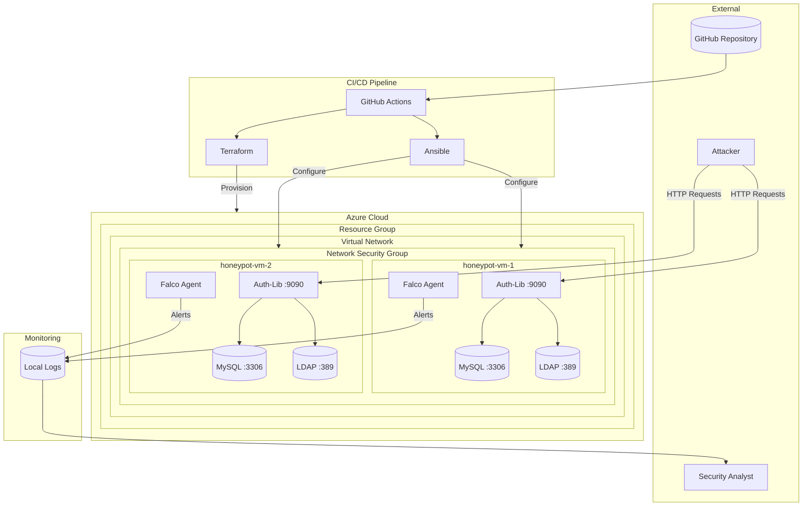
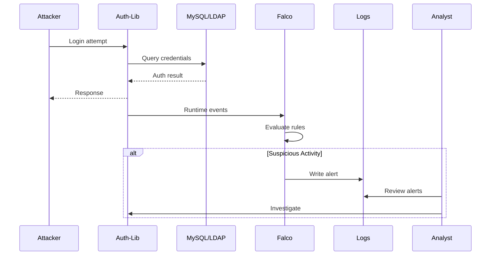
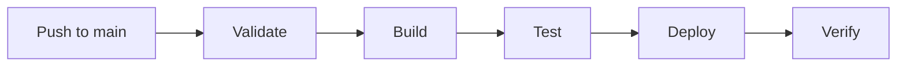

# Azure Cloud Honeypot

<p align="center">
  
  
  
  
  
</p>

<p align="center">
  
  
</p>

---

## Executive Summary

**Azure Cloud Honeypot** is a security research platform designed to attract, detect, and analyze malicious activities in a controlled cloud environment. The system deploys decoy services that mimic real authentication infrastructure, while continuously monitoring all interactions using runtime security tools.

This project demonstrates modern DevSecOps practices by combining Infrastructure as Code (Terraform), Configuration Management (Ansible), and runtime threat detection (Falco) into a fully automated deployment pipeline.

---

## Architecture Overview



---

## Key Features

| Feature | Description |
|---------|-------------|
| **Automated Deployment** | Complete infrastructure provisioning and application deployment through CI/CD |
| **Multi-VM Architecture** | Scalable design supporting multiple honeypot instances |
| **Real Authentication Backend** | Spring Boot application with MySQL and LDAP integration |
| **Runtime Security Monitoring** | Falco-based syscall monitoring and threat detection |
| **Infrastructure as Code** | Reproducible Azure infrastructure using Terraform |
| **Configuration Management** | Consistent server configuration using Ansible roles |

---

## Technology Stack

<table>
<tr>
<td align="center" width="150">

<br><strong>Microsoft Azure</strong>
<br><sub>Cloud Platform</sub>
</td>
<td align="center" width="150">

<br><strong>Terraform</strong>
<br><sub>Infrastructure</sub>
</td>
<td align="center" width="150">

<br><strong>Ansible</strong>
<br><sub>Automation</sub>
</td>
<td align="center" width="150">

<br><strong>Spring Boot</strong>
<br><sub>Application</sub>
</td>
</tr>
<tr>
<td align="center" width="150">

<br><strong>MySQL</strong>
<br><sub>Database</sub>
</td>
<td align="center" width="150">

<br><strong>OpenLDAP</strong>
<br><sub>Directory</sub>
</td>
<td align="center" width="150">

<br><strong>Falco</strong>
<br><sub>Security</sub>
</td>
<td align="center" width="150">

<br><strong>GitHub Actions</strong>
<br><sub>CI/CD</sub>
</td>
</tr>
</table>

---

## How It Works

### 1. Infrastructure Provisioning

Terraform creates the Azure infrastructure including:
- Resource Group for all resources
- Virtual Network with dedicated subnet
- Network Security Group with firewall rules
- Two Ubuntu 22.04 Virtual Machines
- Public IPs for external access

### 2. Service Configuration

Ansible configures each VM with:
- **MySQL Database** - Stores user accounts and session data
- **OpenLDAP Directory** - Provides directory-based authentication
- **Auth-Lib Application** - Spring Boot web application exposing login endpoints
- **Falco Agent** - Monitors system calls and generates security alerts

### 3. Attack Detection Flow



### 4. Continuous Monitoring

Falco continuously monitors:
- Failed authentication attempts
- Unusual process execution
- File system modifications
- Network connections
- Privilege escalation attempts

---

## Project Structure

```
azure-cloud-honeypot/
├── .github/workflows/
│   └── ci-cd.yml              # Unified CI/CD pipeline
├── auth-lib/                   # Spring Boot application
│   ├── src/                    # Java source code
│   ├── build.gradle            # Gradle build configuration
│   └── run.sh                  # Local run script
├── terraform/                  # Infrastructure as Code
│   ├── main.tf                 # Azure resources
│   ├── variables.tf            # Input variables
│   ├── outputs.tf              # Output values
│   └── backend.tf              # Remote state config
├── roles/                      # Ansible roles
│   ├── mysql/                  # MySQL installation
│   ├── openldap/               # OpenLDAP installation
│   ├── auth-lib/               # Application deployment
│   └── falco/                  # Security monitoring
├── playbooks/                  # Ansible playbooks
├── inventories/                # Environment inventories
├── group_vars/                 # Ansible variables
├── docs/                       # Documentation
│   └── diagrams/               # Architecture diagrams
└── site.yml                    # Main orchestration playbook
```

---

## Deployment

### Prerequisites

- Azure subscription with sufficient permissions
- GitHub repository with configured secrets
- Terraform >= 1.0
- Ansible >= 2.9
- Java 17 (for local development)

### Quick Start

1. **Clone the repository**
   ```bash
   git clone https://github.com/leeeyo/cloud-honeypot.git
   cd cloud-honeypot
   ```

2. **Configure Azure credentials**
   
   Set up GitHub secrets (see [Azure Setup Guide](docs/AZURE_SETUP.md))

3. **Deploy infrastructure**
   ```bash
   cd terraform
   terraform init
   terraform apply
   ```

4. **Configure and deploy services**
   ```bash
   ansible-playbook site.yml
   ```

### CI/CD Deployment

Push to the `main` branch triggers automatic deployment:



---

## Security Monitoring

### Falco Rules

The system includes custom Falco rules for detecting:

| Rule | Description | Severity |
|------|-------------|----------|
| Brute Force Detection | Multiple failed login attempts | WARNING |
| SQL Injection | Suspicious SQL patterns in queries | CRITICAL |
| LDAP Injection | Malformed LDAP queries | CRITICAL |
| Shell Spawn | Unexpected shell processes | WARNING |
| File Tampering | Modifications to sensitive files | ERROR |

### Viewing Alerts

```bash
# SSH into a honeypot VM
ssh -i key.pem azizmaram@<vm-public-ip>

# View Falco alerts in real-time
sudo journalctl -u falco -f

# View Falco log file
sudo tail -f /var/log/falco/falco.log
```

---

## Configuration

All configuration is managed through Ansible variables in `group_vars/all.yml`:

| Category | Variables |
|----------|-----------|
| **MySQL** | Database name, credentials, port, character set |
| **OpenLDAP** | Base DN, admin credentials, user definitions |
| **Auth-Lib** | Port, authentication type, JVM settings |
| **Falco** | Rules, output destinations, alerting |

For sensitive data, use [Ansible Vault](https://docs.ansible.com/ansible/latest/vault_guide/index.html):

```bash
ansible-vault encrypt_string 'secret_password' --name 'mysql_password'
```

---

## Future Enhancements

- [ ] Azure Log Analytics integration for centralized logging
- [ ] Falcosidekick for alert forwarding to Slack/Teams
- [ ] Kubernetes (AKS) deployment option
- [ ] Automated threat intelligence correlation
- [ ] Dashboard for real-time attack visualization
- [ ] Machine learning-based anomaly detection

---

## Documentation

| Document | Description |
|----------|-------------|
| [Azure Setup Guide](docs/AZURE_SETUP.md) | Azure credentials and secrets configuration |
| [Diagrams](docs/diagrams/README.md) | Architecture and flow diagrams |
| [MySQL Role](roles/mysql/README.md) | MySQL installation role documentation |
| [OpenLDAP Role](roles/openldap/README.md) | OpenLDAP role documentation |
| [Auth-Lib Role](roles/auth-lib/README.md) | Application deployment documentation |
| [Falco Role](roles/falco/README.md) | Security monitoring documentation |

---

## License

This project is licensed under the MIT License - see the [LICENSE](LICENSE) file for details.

---

## Author

**Aziz Maram**

- GitHub: [@leeeyo](https://github.com/leeeyo)
- Project: Cloud Security Research

---

<p align="center">
  <sub>Built with security research in mind</sub>
</p>
